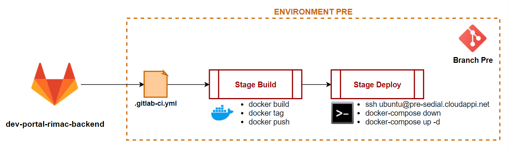

# Devportal Climatetrade Back - Strapi application

## DevOps

## Run
~~~
docker pull registry.gitlab.com/cloudappi/climatetrade/dev-portal-climatetrade-backend:latest
docker run -p 1337:1337 registry.gitlab.com/cloudappi/climatetrade/dev-portal-climatetrade-backend:latest
